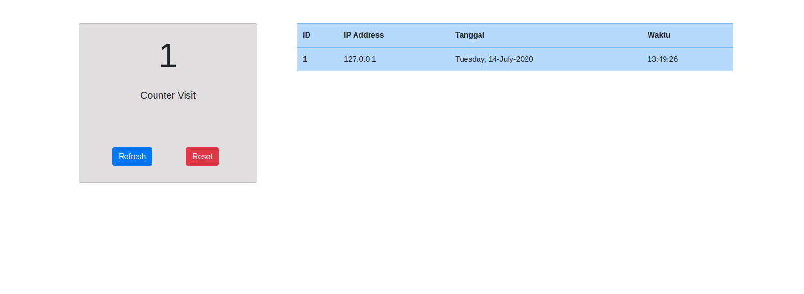

## How to run This App
  * git clone https://github.com/antroytheiz/flask-counter.git
  * cd flask-counter
  * python -m venv env-flask
  * source env-flask/bin/activate
  * pip install Flask
  * pip install Flask-SQLAlchemy
  * pip install Flask-IPInfo
  * python run.py
  * open your browser and typing this *localhost:5000*

### Result App

